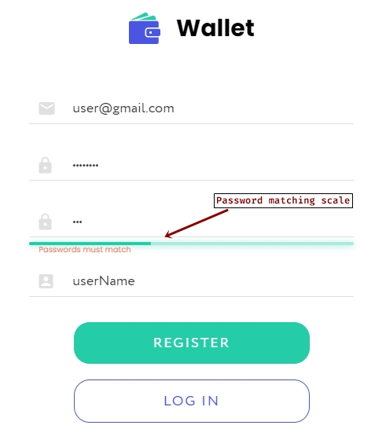
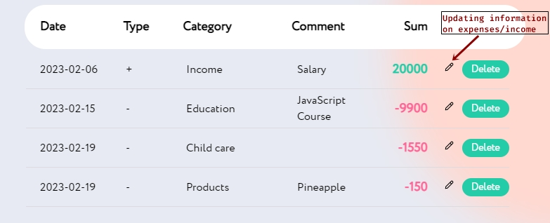
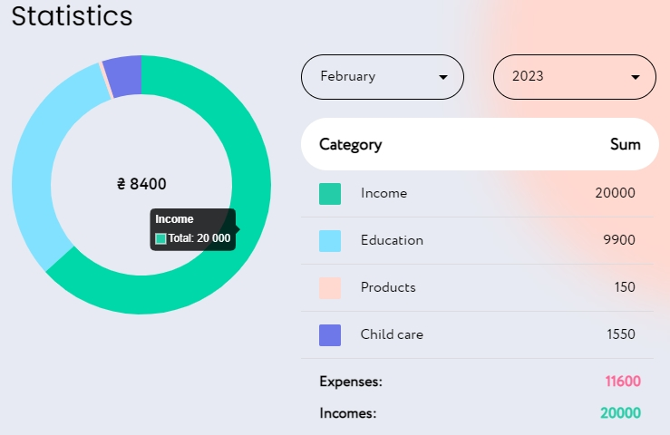

# Wallet

Our project is a web-based expense tracking application that helps users keep
track of their spending and income. With our intuitive interface, users can
easily add new expenses, categorize them, and view their spending over time
using interactive charts.

## Features

- Adaptive design for any device using SASS and Material UI
- User registration and login using React and Redux Toolkit
  
- Ability to add expenses by category using a REST API and Redux Toolkit
- Ability to add income using a REST API and Redux Toolkit
- Editing of previously added information using a REST API and Redux Toolkit
  
- Current exchange rate information from monobank using a REST API
- Display of cost chart by month using chart.js and react-chartjs-2
  

## Usage

To use this website:

- Register or log in with your existing account.
- Add your expenses and income by selecting the appropriate category and
  entering the amount.
- View and edit your previously added information.
- Check the current exchange rate from monobank.
- View the cost chart by month.

## Built With

This website was built using the following technologies:

- React
- Redux Toolkit
- REST API
- Webpack
- HTML
- SASS
- Material UI
- Chart.js, React-chartjs-2

## Contacts

If you have any questions or suggestions, please feel free to contact us:

- [Volodymyr Zdrok](https://github.com/volodymyrzdrok)
- [Valentyna Dzhadan](https://github.com/ValentynaDzhadan)
- [Andrii Posternak](https://github.com/Andrii-Posternak)
- [Dmytro Romaniv](https://github.com/dmromaniv)
- [Viacheslav Puhach](https://github.com/SlavONYX)
- [Myroslava Siryk](https://github.com/Myro4ka)

You can also submit bug reports or feature requests on our GitHub repository:
[Wallet](https://github.com/volodymyrzdrok/where-my-money)

We appreciate your feedback and look forward to hearing from you!
